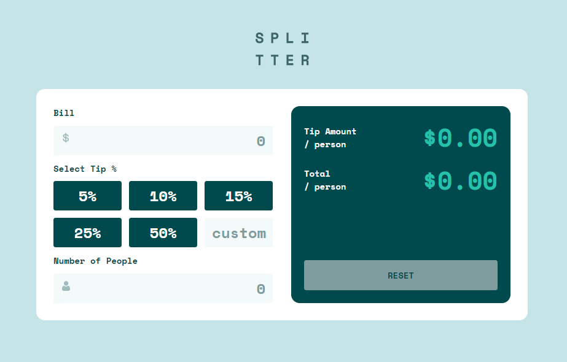

# Frontend Mentor - Tip calculator app solution

## Table of contents

- [Overview](#overview)
  - [The challenge](#the-challenge)
  - [Screenshot](#screenshot)
- [My process](#my-process)
  - [Built with](#built-with)
  - [What I learned](#what-i-learned)
  - [Continued development](#continued-development)
- [Author](#author)

## Overview

### The challenge

Users should be able to:

- View the optimal layout for the app depending on their device's screen size
- See hover states for all interactive elements on the page
- Calculate the correct tip and total cost of the bill per person

### Screenshot

## My process

### Built with

- Semantic HTML5 markup
- CSS custom properties
- Flexbox
- CSS Grid
- Mobile-first workflow

### What I learned

Oh boy, I just realized that, I still have a long way to go on my javascript journey which is very encouraging.

### Continued development

Probably how to structure my code well.

### Useful resources

No resources needed, I challenged myself to do this challenge on my own, which is not exactly the best way but you know you've got to try new things.

## Author

- George Asiedu - [@geoge5-star](https://www.frontendmentor.io/profile/george5-star)
